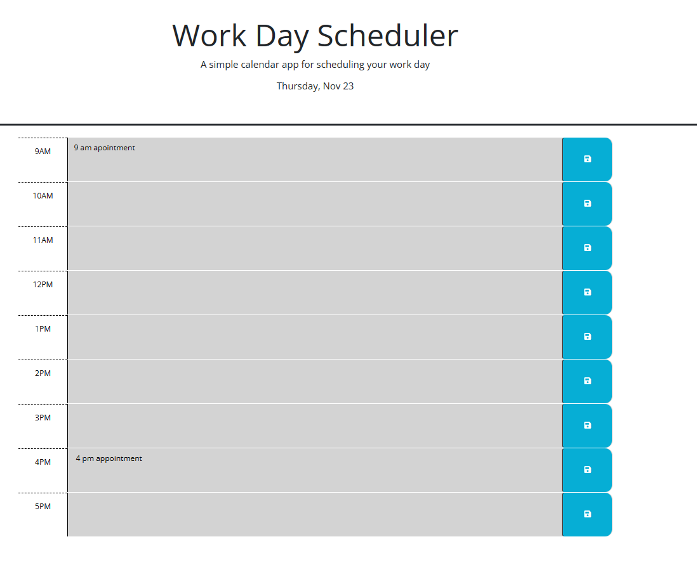

# Motivation

To develop daily planner maintain 9am - 5 pm schedule.

# Table of Contents

1. [About the Project](#about-the-project)
2. [Screenshots](#screenshots)
3. [URL](#url)
4. [Author](#author)

## About the Project

- This application is developed using Third party API's, JQuery, Dayjs, bootstrap and googlefonts.
- User is presented with a daily planned with time 9am till 5 pm slots
- User can enter hourly tasks fot the day. On page load the saved tasks can be seen on the planner.
- current time, past and future time is shown in different color code.

## Screenshots

## URL

# Author

Sangeetha Gnanavel, a Full Stack Developer having enormous experience in Front-end and Back-end application development.

**[Back to top](#table-of-contents)**
